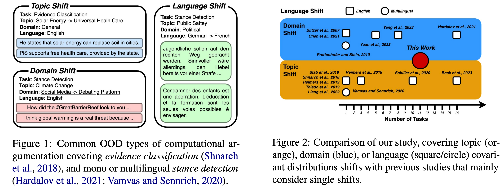

# How to Handle Different Types of Out-of-Distribution Scenarios in Computational Argumentation? A Comprehensive and Fine-Grained Field Study




This repository includes the code of the experiments reported in [How to Handle Different Types of Out-of-Distribution Scenarios in Computational Argumentation? A Comprehensive and Fine-Grained Field Study
](https://arxiv.org/abs/2309.08316).
These experiments include the three considered out-of-distribution shift types (Figure 1) across the diverse set of eleven tasks (Figure 2).
As some of the considered dataset are licensed, please reach out to us if you want to have access to all the folds. 
We are happy to share the exact splits with you.
Further please report an issue or e-mail us if something is broken (and it shouldn't be) or if you have further questions.


> **Abstract:** The advent of pre-trained Language Models (LMs) has markedly advanced natural language processing, but their efficacy in out-of-distribution (OOD) scenarios remains a significant challenge. Computational argumentation (CA), modeling human argumentation processes, is a field notably impacted by these challenges because complex annotation schemes and high annotation costs naturally lead to resources barely covering the multiplicity of available text sources and topics. Due to this data scarcity, generalization to data from uncovered covariant distributions is a common challenge for CA tasks like stance detection or argument classification. This work systematically assesses LMs' capabilities for such OOD scenarios. While previous work targets specific OOD types like topic shifts or OOD uniformly, we address three prevalent OOD scenarios in CA: topic shift, domain shift, and language shift. Our findings challenge the previously asserted general superiority of in-context learning (ICL) for OOD. We find that the efficacy of such learning paradigms varies with the type of OOD. Specifically, while ICL excels for domain shifts, prompt-based fine-tuning surpasses for topic shifts. To sum up, we navigate the heterogeneity of OOD scenarios in CA and empirically underscore the potential of base-sized LMs in overcoming these challenges.

Contact person: Andreas Waldis, andreas.waldis@live.com

https://www.ukp.tu-darmstadt.de/

https://www.tu-darmstadt.de/


> This repository contains experimental software and is published for the sole purpose of giving additional background details on the respective publication.


## Project structure

* `src/` -- necessary code to run the experiments
* `task/` -- contains the out-of-distribution (ood) and in-distribution (id) task files
  * ct: cross-topic (arg-qua, arg-sim, arg-cls, evi-cls, x-stance)
  * cd: cross-domain (review, stance, entail, x-review)
  * cl: cross-language (x-stance, x-review)
  * it: in-topic (arg-qua, arg-sim, arg-cls, evi-cls, x-stance)
  * id: in-domain (review, stance, entail, x-review)
  * il: in-lanugage (x-stance, x-review)

## Setup

This repository requires Python3.6 or higher; further requirements can be found in the requirements.txt. 
Install them with the following command:

```
$ python3 -m venv venv
$ source venv/bin/activate
$ pip install -r requirements.txt
```

Next, you need to setup the `.env`.
Either copy `.env_dev` (development) or `.env_prod` (production) to `.env` and set your openai (`OPENAI_KEY`) key, if you would like to run the in-context learning experiments. 

```
$ cp .env_dev .env #development
$ cp .env_prod .env #production
```

Finally, you need to log in with your wandb account for performance reporting. 

```
$ wandb login
```

## Tasks

This work relies on the following different datasets:
*  Argument Quality (`arg-qua`), available [here](https://research.ibm.com/haifa/dept/vst/debating_data.shtml)
*  Argument Similarity (`arg-sim`), available [here](https://huggingface.co/datasets/UKPLab/UKP_ASPECT)
*  Argument Classification (`arg-cls`), available [here](https://tudatalib.ulb.tu-darmstadt.de/handle/tudatalib/2345)
*  Evidence Classification (`evi-cls`), available [here](https://research.ibm.com/haifa/dept/vst/debating_data.shtml)
*  Entailment (`entail`), RTE is available [here](https://huggingface.co/datasets/nyu-mll/glue), SCITAIL [here](https://huggingface.co/datasets/allenai/scitail), and HANS [here](https://huggingface.co/datasets/jhu-cogsci/hans)
*  Sentiment Analysis (`review`), available [here](https://www.cs.jhu.edu/~mdredze/datasets/sentiment/index2.html)
*  Stance Detection (`stance`), SemEval2016Task6 is available [here](http://alt.qcri.org/semeval2016/task6/), EMERGENT [here](https://github.com/willferreira/mscproject), and IAC [here](https://nlds.soe.ucsc.edu/iac)
*  Multi-Lingual Stance Detection (`x-stance`), available [here](https://huggingface.co/datasets/ZurichNLP/x_stance)
*  Multi-Lingual Sentiment Analysis (`x-review`), available [here](https://zenodo.org/record/3251672/files/cls-acl10-unprocessed.tar.gz)

Some of these datasets requires accepting conditions, but we are happy to share our parsed version with you. 
Send us these datasets as zip to proof that you have access.
Afterward, we share our splits and you can put them into the `tasks` folder. 

## Running the experiments

Please use the following scripts to run the different experiments.
For all of them take the following general parameters:
* `task`, specific task to run, for example `arg-cls`
* `model_name`, specific model (huggingface tag) to run, for example `bert-base-uncased"`
* `fold`, specific fold to run, for example `0`
* `setup`, specific setup to run, depends on the task, either cross-topic (`ct`), in-topic (`it`), cross-domain (`cd`), in-domain (`id`), cross-language (`cl`), or in-language (`il`)


### Probing (LP) Experiments (`run_frozen.py`)
Mono- and multi-lingual linear probing experiments, additional parameters:

* `seed`, specific random seed
* `pooling`, pooling method, for example `mean`
* `batch_size`, batch size for training, for example `16`
* `learning_rate`, learning rate for training, for example `0.0005`


### Prompting (P) Experiments (`run_prompt.py` and `run_x_prompt.py`)
Mono- or multi-lingual prompting experiments, additional parameters:

* `seed`, specific random seed
* `batch_size`, batch size for inference, for example `16`
* `verbalizing_mode`, verbalizing mode, either `static` (label specific tokens) or `automatic` (50 optimized tokens per label)


### Fine-Tuning (FT) Experiments (`run_fine-tuning.py`)
Vanilla mono- and multi-lingual fine-tuning experiments, additional parameters:

* `seed`, specific random seed
* `pooling`, pooling method, for example `cls`
* `batch_size`, batch size for training, for example `16`
* `learning_rate`, learning rate for training, for example `0.0005`
* `epochs`, specific number of epochs to train, for example `5`
* `dropout_rate`, dropout rate during training, for example `0.1`

### Prompt-Based Fine-Tuning (P+FT) Experiments (`run_prompt_tuning.py` and `run_x_prompt_tuning.py`)
Prompt-based mono- and multi-lingual fine-tuning experiments, additional parameters:
* `seed`, specific random seed
* `pooling`, pooling method, for example `cls`
* `batch_size`, batch size for training, for example `16`
* `learning_rate`, learning rate for training, for example `0.0005`
* `epochs`, specific number of epochs to train, for example `5`
* `verbalizing_mode`, verbalizing mode, either `static` (label specific tokens) or `automatic` (50 optimized tokens per label)


### Parameter-Efficient Prompt-Based Fine-Tuning (P+FT+LoRA) Experiments (`run_peft_prompt_tuning.py`)
Vanilla mono- and multi-lingual fine-tuning experiments, additional parameters:

* `seed`, specific random seed
* `pooling`, pooling method, for example `cls`
* `batch_size`, batch size for training, for example `16`
* `learning_rate`, learning rate for training, for example `0.0005`
* `verbalizing_mode`, verbalizing mode, either `static` (label specific tokens) or `automatic` (50 optimized tokens per label)
* `peft_mode`, specific efficient method, for example `LORA`
* `lora_r`, if using LORA the specific `r`, for example `4`

### In-Context Learning Experiments (`run_icl.py`)
In-context learning experiments

* `seed`, specific random seed
* `k`, number of demonstration examples, for example `4`
* `bm25_retrieval`, whether to use BM25 to retrieve most similar examples, for example `True`


## Citation

```
@inproceedings{Waldis2023HowTH,
  title={How to Handle Different Types of Out-of-Distribution Scenarios in Computational Argumentation? A Comprehensive and Fine-Grained Field Study},
  author={Andreas Waldis and Iryna Gurevych},
  year={2023},
  url={https://api.semanticscholar.org/CorpusID:262013145}
}
```
